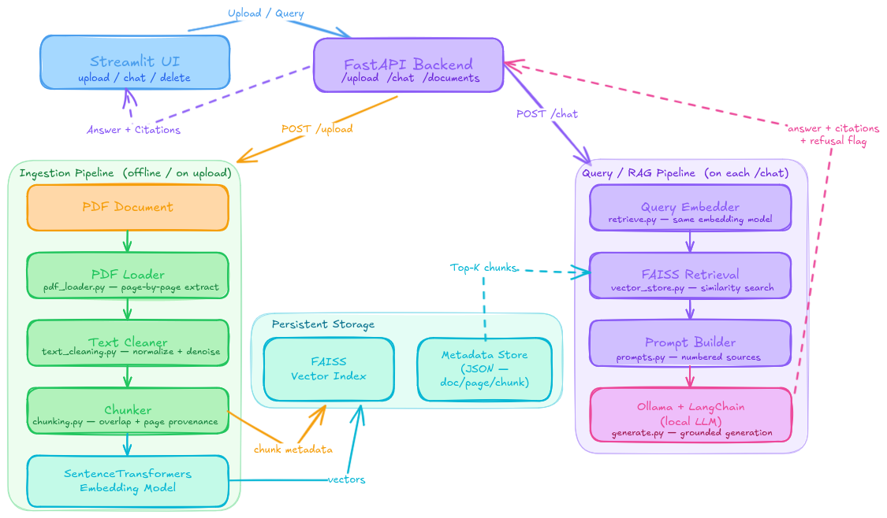

# CiteRAG

<div align="center">


Local Retrieval-Augmented Generation (RAG) system for PDF question answering with source citations


</div>

> [!NOTE]
> CiteRAG is fully local and free to run: no paid API keys are required.

## Table of Contents

- [Overview](#overview)
- [Core Features](#core-features)
- [Architecture](#architecture)
- [How It Works](#how-it-works)
- [Tech Stack](#tech-stack)
- [Project Structure](#project-structure)
- [Getting Started](#getting-started)
- [Configuration](#configuration)
- [Run the Application](#run-the-application)
- [API Reference](#api-reference)
- [Streamlit Workflow](#streamlit-workflow)
- [Evaluation](#evaluation)
- [Docker](#docker)
- [Testing and Quality](#testing-and-quality)
- [Troubleshooting](#troubleshooting)

## Overview

CiteRAG lets you:

- Upload PDF documents.
- Automatically parse, clean, chunk, embed, and index document content.
- Ask grounded questions in chat.
- See citations for retrieved sources (`doc`, `page`, `chunk_id`).
- Restrict answers to selected indexed documents.
- Permanently delete indexed documents (hard delete + FAISS rebuild).

The goal is to reduce hallucinations by forcing answers to come from retrieved context.

## Core Features

| Feature | Description |
|---|---|
| Local ingestion | PDF -> cleaned text -> chunks -> embeddings -> FAISS + metadata |
| Grounded generation | Answers are generated from retrieved chunks only |
| Refusal behavior | Returns a fixed refusal message when context is insufficient |
| Source traceability | Citations include document id, page, and chunk id |
| Document scoping | Query only selected indexed documents |
| Hard delete | Remove documents from metadata and rebuild FAISS index |
| Persistent storage | Index and metadata survive restarts |

## Architecture

<div align="center">
  

**CiteRAG Full Architecture**
</div>

## How It Works

### 1) Ingestion pipeline

| Step | Module | Purpose |
|---|---|---|
| PDF load | `app/utils/pdf_loader.py` | Extract text page by page |
| Cleaning | `app/utils/text_cleaning.py` | Normalize text and remove noise |
| Chunking | `app/utils/chunking.py` | Split text into overlapping chunks with page provenance |
| Embedding | `app/rag/ingest.py` | Convert chunks to vectors (SentenceTransformers) |
| Persistence | `app/storage/vector_store.py`, `app/storage/metadata_store.py` | Save vectors + chunk metadata |

### 2) Query/RAG pipeline

| Step | Module | Purpose |
|---|---|---|
| Query embedding | `app/rag/retrieve.py` | Embed user question |
| Retrieval | `app/storage/vector_store.py`, `app/rag/retrieve.py` | Similarity search over FAISS |
| Prompt building | `app/rag/prompts.py` | Format retrieved chunks as numbered sources |
| Generation | `app/rag/generate.py` | Call Ollama via LangChain and return final answer |
| API/UI response | `app/main.py`, `ui/streamlit_app.py` | Return answer, refusal flag, and citations |

> [!TIP]
> Use the same embedding model for both ingestion and retrieval (`CITERAG_EMBEDDING_MODEL`) to avoid vector-space mismatch.

## Tech Stack

| Layer | Tools |
|---|---|
| Backend API | FastAPI, Pydantic |
| UI | Streamlit |
| LLM runtime | Ollama + `langchain-ollama` |
| Embeddings | `sentence-transformers` |
| Vector DB | FAISS (`faiss-cpu`) |
| PDF parsing | `pypdf` |
| Testing and linting | `pytest`, `ruff` |
| Containerization | Docker |

## Project Structure

```text
CiteRAG/
├─ app/                          # Application source code
│  ├─ main.py                    # FastAPI entry point and REST endpoints
│  ├─ rag/                       # RAG orchestration logic
│  │  ├─ ingest.py               # PDF -> chunks -> embeddings -> index
│  │  ├─ retrieve.py             # Similarity retrieval + metadata join
│  │  ├─ generate.py             # Prompt + Ollama generation
│  │  ├─ prompts.py              # Prompt templates and source formatting
│  │  ├─ delete.py               # Hard delete + FAISS rebuild logic
│  │  └─ schemas.py              # API request/response models
│  ├─ storage/                   # Persistence wrappers
│  │  ├─ vector_store.py         # FAISS index + id mapping
│  │  └─ metadata_store.py       # Chunk metadata JSON store
│  └─ utils/                     # Shared utilities
│     ├─ pdf_loader.py           # PDF text extraction
│     ├─ text_cleaning.py        # Text normalization helpers
│     └─ chunking.py             # Chunking with overlap/page mapping
├─ ui/
│  └─ streamlit_app.py           # User interface (upload/index/chat/delete)
├─ scripts/
│  ├─ build_index.py             # CLI ingestion/indexing utility
│  └─ eval_rag.py                # Retrieval/groundedness evaluation tool
├─ tests/                        # Unit/integration tests
├─ docker/
│  └─ Dockerfile                 # Container image definition
├─ project_description/          # Project requirements and target scope
├─ requirements.txt              # Python dependencies
├─ .env.example                  # Environment variable template
├─ CHANGELOG.md                  # Release history
└─ RELEASE_NOTES_v0.1.0.md       # Current release notes
```

## Getting Started

### Prerequisites

- Python 3.10+ (3.11 recommended)
- Ollama installed locally
- Linux/macOS shell (commands below use bash syntax)

### 1) Create a virtual environment

```bash
python3 -m venv .venv
source .venv/bin/activate
```

### 2) Install dependencies

```bash
pip install -r requirements.txt
```

### 3) Configure environment variables

```bash
cp .env.example .env
```

## Configuration

Environment variables are loaded from the project root `.env`.

| Variable | Default | Purpose |
|---|---|---|
| `CITERAG_OLLAMA_MODEL` | `llama3.2:1b` | Local generation model |
| `CITERAG_OLLAMA_BASE_URL` | `http://localhost:11434` | Ollama server URL |
| `CITERAG_EMBEDDING_MODEL` | `all-MiniLM-L6-v2` | Embedding model for ingest/retrieval |
| `CITERAG_LOG_LEVEL` | `INFO` | Streamlit logging verbosity |

> [!WARNING]
> On low-memory machines, prefer `llama3.2:1b` (or another small model) to avoid Ollama memory errors.

## Run the Application

### 1) Start Ollama and pull a model

```bash
ollama serve
ollama pull llama3.2:1b
```

If `ollama serve` reports that port `11434` is already in use, Ollama is likely already running as a background service.

### 2) Start FastAPI

```bash
uvicorn app.main:app --reload
```

API docs: `http://127.0.0.1:8000/docs`

### 3) Start Streamlit

```bash
streamlit run ui/streamlit_app.py
```

### Optional: CLI indexing

```bash
python scripts/build_index.py tests/sample.pdf
python scripts/build_index.py ./docs --recursive
```

## API Reference

| Endpoint | Method | Description |
|---|---|---|
| `/documents/upload` | `POST` | Upload and ingest a PDF |
| `/documents` | `GET` | List indexed document IDs |
| `/documents/delete` | `POST` | Hard-delete documents and rebuild index |
| `/chat` | `POST` | Ask a question and get answer + citations |

### Example `/chat` request

```json
{
  "question": "What is the main topic?",
  "doc_ids": ["mydoc.pdf-abc12345"],
  "top_k": 6,
  "min_score": 0.25
}
```

### Example `/chat` response

```json
{
  "answer": "The document discusses ... [1]\n\nSources: [1]",
  "citations": [
    {
      "id": 1,
      "doc": "mydoc.pdf-abc12345",
      "page": 3,
      "chunk_id": "mydoc.pdf-abc12345::p0003::c0002",
      "text_preview": "..."
    }
  ],
  "refusal": false,
  "model": "llama3.2:1b"
}
```

## Streamlit Workflow

1. Upload one or more PDFs and click `Index document`.
2. In the sidebar, choose documents under `Answer from documents`.
3. Ask questions in chat and inspect source snippets in the `Sources` expander.
4. Remove irrelevant docs from `Manage indexed docs` using permanent delete.

## Evaluation

Evaluate retrieval only:

```bash
python scripts/eval_rag.py --dataset eval/examples.json --skip-generation
```

Evaluate retrieval + generation:

```bash
python scripts/eval_rag.py --dataset eval/examples.json --output eval/report.json
```

Supported dataset formats:

- JSON list
- JSON object with `examples`
- JSONL

Minimal record:

```json
{
  "id": "q1",
  "question": "What is ...?",
  "doc_ids": ["mydoc.pdf-abc12345"],
  "expected_doc_ids": ["mydoc.pdf-abc12345"],
  "must_refuse": false
}
```

## Docker

Build image:

```bash
docker build -f docker/Dockerfile -t citerag:latest .
```

Run FastAPI:

```bash
docker run --rm -it \
  -p 8000:8000 \
  --env-file .env \
  -v "$(pwd)/data:/app/data" \
  --add-host=host.docker.internal:host-gateway \
  citerag:latest
```

Run Streamlit:

```bash
docker run --rm -it \
  -p 8501:8501 \
  --env-file .env \
  -v "$(pwd)/data:/app/data" \
  --add-host=host.docker.internal:host-gateway \
  citerag:latest \
  streamlit run ui/streamlit_app.py --server.address 0.0.0.0 --server.port 8501
```

## Testing and Quality

Run tests:

```bash
pytest -q
```

Run lint:

```bash
ruff check .
```

## Troubleshooting

> [!NOTE]
> First run can be slow because embedding/LLM models may need to download and warm up.

> [!WARNING]
> `Generation failed: [Errno 111] Connection refused` usually means Ollama is not reachable at `CITERAG_OLLAMA_BASE_URL`.

> [!TIP]
> If a model is missing, run `ollama pull <model_name>` and verify with `ollama list`.

---

[Back to TOC](#table-of-contents)
